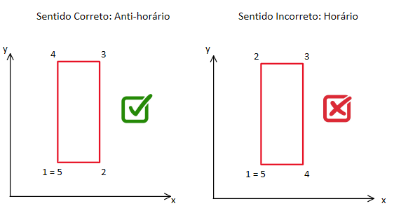
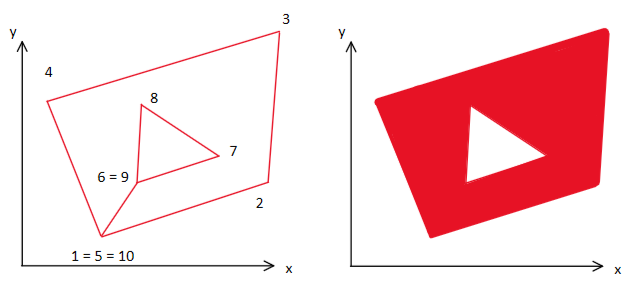
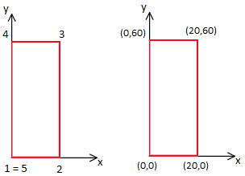

<h1>Propriedades Geométricas</h1>

<p>Esta documentação tem o objetivo de contextualizar com relação ao projeto  <i>geometric_props_py</i> e está disponível tanto em inglês (en) quanto português-Brasil (pt-br). Serão abordados os seguintes tópicos:</p>

<ol>
  <li>O que é / objetivo do projeto</li>
  <li>Introdução</li>
  <li>Como executar a aplicação</li>
  <li>Tecnologias Utilizadas</li>
  <li>Exemplos</li>
  <li>Licença de Uso</li>
  <li>Referências bibliográficas</li>
</ol>


<h2>1 - O que é / objetivo do projeto</h2>
<p>O projeto tem como objetivo calcular um conjunto de propriedades geométricas de figuras poligonais inseridas em um plano bidimensional. Nesse projeto, implementa-se uma classe utilizando a linguagem de programação python que abstrai a metodologia utilizada no teorema de green, que transforma integrais de superfície em integrais de linha ao longo de um contorno para assim, calcular as seguintes propriedades geométricas:</p>

Observação: As unidades disponibilizadas na tabela são válidas quando se insere as coordenadas da figura poligonal em centímetros (cm).

| Left-aligned | Center-aligned | Right-aligned |
| :---         |     :---:      |          ---: |
| git status   | git status     | git status    |
| git diff     | git diff       | git diff      |


<table border="1">
  <thead>
  <th>Propriedades Geométricas</th>
  <th>Sigla</th>
  <th>Unidade</th>
  </thead>
  <tbody>
    <tr>
      <td>Área da seção</td>
      <td style="text-align: center;">A</td>
      <td style="text-align: center;">cm²</td>
    </tr>
    <tr>
      <td>Momento estático com relação ao eixo x</td>
      <td style="text-align: center;">S<sub>x</sub></td>
      <td style="text-align: center;">cm³</td>
    </tr>
    <tr>
      <td>Momento estático com relação ao eixo y</td>
      <td style="text-align: center;">S<sub>y</sub></td>
      <td style="text-align: center;">cm³</td>
    </tr>
    <tr>
      <td>Momento de inércia com relação ao eixo x</td>
      <td style="text-align: center;">I<sub>x</sub></td>
      <td style="text-align: center;">cm⁴</td>
    </tr>
    <tr>
      <td>Momento de inércia com relação ao eixo y</td>
      <td style="text-align: center;">I<sub>y</sub></td>
      <td style="text-align: center;">cm⁴</td>
    </tr>
    <tr>
      <td>Produto da inércia em relação aos eixos x e y</td>
      <td style="text-align: center;">I<sub>xy</sub></td>
      <td style="text-align: center;">cm⁴</td>
    </tr>
    <tr>
      <td>Centróide da seção em relação ao eixo x</td>
      <td style="text-align: center;">x<sub>g</sub></td>
      <td style="text-align: center;">cm</td>
    </tr>
    <tr>
      <td>Centróide da seção em relação ao eixo y</td>
      <td style="text-align: center;">y<sub>g</sub></td>
      <td style="text-align: center;">cm</td>
    </tr>
    <tr>
      <td>Momento de inércia baricêntrica (com relação ao centróide) no eixo x</td>
      <td style="text-align: center;">I<sub>xg</sub></td>
      <td style="text-align: center;">cm⁴</td>
    </tr>
    <tr>
      <td>Momento de inércia baricêntrica (com relação ao centróide) no eixo y</td>
      <td style="text-align: center;">I<sub>yg</sub></td>
      <td style="text-align: center;">cm⁴</td>
    </tr>
    <tr>
      <td>Distância vertical entre o centro de gravidade e o ponto mais baixo ao longo do eixo vertical</td>
      <td style="text-align: center;">Y<sub>1</sub></td>
      <td style="text-align: center;">cm</td>
    </tr>
    <tr>
      <td>Distância vertical entre o ponto mais alto ao longo do eixo vertical e o centro de gravidade</td>
      <td style="text-align: center;">Y<sub>2</sub></td>
      <td style="text-align: center;">cm</td>
    </tr>
    <tr>
      <td>Módulo resistente, calculado considerando Y<sub>1</sub></td>
      <td style="text-align: center;">W<sub>1</sub></td>
      <td style="text-align: center;">cm³</td>
    </tr>
    <tr>
      <td>Módulo resistente, calculado considerando Y<sub>2</sub></td>
      <td style="text-align: center;">W<sub>2</sub></td>
      <td style="text-align: center;">cm³</td>
    </tr>
    <tr>
      <td>Altura</td>
      <td style="text-align: center;">h</td>
      <td style="text-align: center;">cm</td>
    </tr>
  </tbody>
</table>

<br>

<p>Além disso, a aplicação permite também obter mais algumas informações relevantes, como:</p>

<table border="1">
  <thead>
  <th>Informação</th>
  <th>Sigla</th>
  <th>Unidade</th>
  </thead>

  <tbody>
    <tr>
      <td>Coordenada máxima com relação ao eixo x</td>
      <td>x<sub>max</sub></td>
      <td style="text-align: center;">cm</td>
    </tr>
    <tr>
      <td>Coordenada mínima com relação ao eixo x</td>
      <td>x<sub>min</sub></td>
      <td style="text-align: center;">cm</td>
    </tr>
    <tr>
      <td>Coordenada máxima com relação ao eixo y</td>
      <td>y<sub>max</sub></td>
      <td style="text-align: center;">cm</td>
    </tr>
    <tr>
      <td>Coordenada mínima com relação ao eixo y</td>
      <td>y<sub>min</sub></td>
      <td style="text-align: center;">cm</td>
    </tr>
  </tbody>
</table>

<h2>2 - Introdução</h2>

<p>A aplicação permite que se trabalhe com figuras vazadas, mas deve-se atentar aos seguintes cuidados, a inserção de uma seção se da a medida que os vértices são inseridos no sentido anti-horário, enquanto a remoção de uma seção se da a medida que seus vértices são inseridos no sentido horário.</p>

<p>No exemplo introdutório a seguir, deseja-se calcular as propriedades de uma figura com 4 vértices, essa figura não apresenta seção vazada (sua seção é maciça). Deve-se tomar cuidado com a ordem de inserção dos vértices. O primeiro ponto é marcado com o número 1, o segundo com o número 2 e assim por diante. Nota-se que é necessário reinserir o ponto inicial, de tal forma que a coordenadas do eixo x e y do primeiro ponto e do último ponto são as mesmas. Na imagem a seguir, é apresentado na esquerda uma imagem que indica a ordem correta de inserção dos pontos, já na direita temos um exemplo de um erro comum que é utilizar o sentido errado na inserção dos pontos.</p>



<br>
<p>A seguir será apresentada uma figura em que sua seção é vazada, nesse caso, a ordem dos pontos será:</p>




<h2>3 - Como executar a aplicação</h2>

<p>O primeiro passo para executar a aplicação é realizar a importação da classe contida no arquivo <i>geometricProps.py</i>. Caso o projeto esteja na mesma pasta que o arquivo da classe, deve-se inserir:</p>

<code>from geometricProps import GeometricProps</code>

<p>A próxima etapa é criar uma instância da classe, nesse caso, é esperado no argumento umas lista de dicionário, cada dicionário deve contar a propriedade x, que faz referência a coordenada no eixo x, e deve conter também a propriedade y, que faz referência a coordenada no eixo y. Cada vértice da figura está estritamente relacionado a uma posição da lista, em que dentro está contido um dicionário que necessita da possição do vértice em relação ao eixo x e em relação ao eixo y. Ao instanciar a classe, a seguinte estrutura deve ser fornecida:</p>

No caso a seguir queremos representar uma figura retangular com base de 20cm e altura de 60cm, em que a quina inferior esquerda está situada nas coordenadas (0,0). A tabela e a figura a seguir, representam a situação em questão:

  <table border="1">
    <thead>
    <th>Ponto</th>
    <th>Coordenada no eixo x (cm)</th>
    <th>Coordenada no eixo y (cm)</th>
    </thead>
    <tbody>
      <tr>
        <td style="text-align: center;">1</td>
        <td style="text-align: center;">0</td>
        <td style="text-align: center;">0</td>
      </tr>
      <tr>
        <td style="text-align: center;">2</td>
        <td style="text-align: center;">20</td>
        <td style="text-align: center;">0</td>
      </tr>
      <tr>
        <td style="text-align: center;">3</td>
        <td style="text-align: center;">20</td>
        <td style="text-align: center;">60</td>
      </tr>
      <tr>
        <td style="text-align: center;">4</td>
        <td style="text-align: center;">0</td>
        <td style="text-align: center;">60</td>
      </tr>
      <tr>
        <td style="text-align: center;">5</td>
        <td style="text-align: center;">0</td>
        <td style="text-align: center;">0</td>
      </tr>
    </tbody>
  </table>

<br>

<p>A imagem ilustrativa que representa a situação descrita na tabela é apresentada a seguir:</p>

  


<br>

<p>Após ter realizado a importação da classe, deve-se criar uma instância e atribuir em uma variável. Nesse caso, será criada a variável <code>retangulo</code> e atribuida a instância da classe que espera receber no seu construtor, uma lista indicada por <code>[]</code> e cada posição dessa lista deve ser um dicionário indicado por <code>{}</code>. Dentro desse dicionário, será inserido um conjunto chave, valor que faz referência ao eixo (x ou y) e ao valor de referência.
</p>

```
retangulo = GeometricProps(
    [
        {'x':0, 'y':0}, 
        {'x':20, 'y':0}, 
        {'x':20, 'y':60}, 
        {'x':0, 'y':60}, 
        {'x':0, 'y':0}
    ])
```
  
<p>Após ter instanciado a classe corretamente, já é possível acessar todas as propriedades descrita na tabela de proprieades geométricas, cada propriedade geométrica é uma respectiva propriedade da classe. A seguir será apresentado o nome da propriedade da classe e sua propriedade geométrica correspondente.</p>

<h3>Nome da propriedade geométrica e respectiva propriedade da classe:</h3>

<table border="1">
  <thead>
  <th>Propriedade Geométrica</th>
    <th>Propriedade da classe</th>
  </thead>

  <tbody>
    <tr>
      <td>Área da seção (A)</td>
      <td>retangulo.A</td>
    </tr>
    <tr>
      <td>Momento estático com relação ao eixo x (S<sub>x</sub>)</td>
      <td>retangulo.Sx</td>
    </tr>
    <tr>
      <td>Momento estático com relação ao eixo y (S<sub>y</sub>)</td>
      <td>retangulo.Sy</td>
    </tr>
    <tr>
      <td>Momento de inércia com relação ao eixo x (I<sub>x</sub>)</td>
      <td>retangulo.Ix</td>
    </tr>
    <tr>
      <td>Momento de inércia com relação ao eixo y (I<sub>y</sub>)</td>
      <td>retangulo.Iy</td>
    </tr>
    <tr>
      <td>Produto da inércia em relação aos eixos x e y (I<sub>xy</sub>)</td>
      <td>retangulo.Ixy</td>
    </tr>
    <tr>
      <td>Centróide da seção em relação ao eixo x (x<sub>g</sub>)</td>
      <td>retangulo.Xg</td>
    </tr>
    <tr>
      <td>Centróide da seção em relação ao eixo y (y<sub>g</sub>)</td>
      <td>retangulo.Yg</td>
    </tr>
    <tr>
      <td>Momento de inércia baricêntrica (com relação ao centróide) no eixo x (I<sub>xg</sub>)</td>
      <td>retangulo.Ixg</td>
    </tr>
    <tr>
      <td>Momento de inércia baricêntrica (com relação ao centróide) no eixo y (I<sub>yg</sub>)</td>
      <td>retangulo.Iyg</td>
    </tr>
    <tr>
      <td>Produto de inércia com relação ao centróide em x e y (I<sub>xyg</sub>)</td>
      <td>retangulo.Ixyg</td>
    </tr>
    <tr>
      <td>Distância vertical entre o centro de gravidade e o ponto mais baixo ao longo do eixo vertical (Y<sub>1</sub>)</td>
      <td>retangulo.Y1</td>
    </tr>
    <tr>
      <td>Distância vertical entre o ponto mais alto ao longo do eixo vertical e o centro de gravidade (Y<sub>2</sub>)</td>
      <td>retangulo.Y2</td>
    </tr>
    <tr>
      <td>Módulo resistente, calculado considerando Y<sub>1</sub> (W<sub>1</sub>)</td>
      <td>retangulo.W1</td>
    </tr>
    <tr>
      <td>Módulo resistente, calculado considerando Y<sub>2</sub> (W<sub>2</sub>)</td>
      <td>retangulo.W2</td>
    </tr>
    <tr>
      <td>Altura (h)</td>
      <td>retangulo.h</td>
    </tr>
  </tbody>
</table>

<h3>Acessando cada propriedade geométrica e demais informações</h3>

<h4>Valor máximo referente ao eixo x:</h4>
<code>print("O valor máximo referente ao eixo x é", retangulo.Xmax)<code>

<h4>Valor mínimo referente ao eixo x:</h4>
<code>print("O valor mínimo referente ao eixo x é", retangulo.Xmin)</code>

<h4>Valor máximo referente ao eixo y:</h4>
<code>print("O valor máximo referente ao eixo y é", retangulo.Ymax)</code>

<h4>Valor mínimo referente ao eixo y:</h4>
<code>print("O valor máximo referente ao eixo y é", retangulo.Ymin)</code>

<h4>Área:</h4>
<code>print("O valor da área é: ", retangulo.A)</code>

<h4>Momento estático em relação ao eixo x:</h4>
<code>print("O valor do momento estático em relação ao eixo x é: ", retangulo.Sx)</code>

<h4>Momento estático em relação ao eixo y:</h4>
<code>print("O valor do momento estático em relação ao eixo y é: ", retangulo.Sy)</code>

<h4>Momento de inérica em relação ao eixo x:</h4>
<code>print("O valor do momento de inérica em relação ao eixo x é: ", retangulo.Ix)</code>

<h4>Momento de inérica em relação ao eixo y:</h4>
<code>print("O valor do momento de inérica em relação ao eixo y é: ", retangulo.Iy)</code>

<h4>Produto da inércia em relação aos eixos x e y:</h4>
<code>print("O produto da inércia em relação aos eixos x e y: ", retangulo.Ixy)</code>

<h4>Centróde em relação ao eixo x:</h4>
<code>print("O valor do centroide em relação ao eixo x é: ", retangulo.Xg)</code>

<h4>Centróde em relação ao eixo y:</h4>
<code>print("O valor do centroide em relação ao eixo y é: ", retangulo.Yg)</code>

<h4>Inércia em relação ao centróde em x:</h4>
<code>print("O valor da inércia em relação ao centroide em x é: ", retangulo.Ixg)</code>

<h4>Inércia em relação ao centróde em y:</h4>
<code>print("O valor da inércia em relação ao centroide em y é: ", retangulo.Iyg)</code>

<h4>Produto da inércia com relação ao centróide em x e y:</h4>
<code>print("O valor da inércia em relação ao centroide em xy é: ", retangulo.Ixyg)</code>

<h4>Distância vertical Y1 entre o centro de gravidade e o ponto mais baixo ao longo do eixo vertical da seção transversal:</h4>
<code>print('A distância vertical Y1 entre o centro de gravidade e o ponto mais baixo ao longo do eixo vertical da seção transversal analisada é:', retangulo.Y1)
</code>

<h4>Distância vertical Y2 entre o ponto mais alto ao longo do eixo vertical e o centro de gravidade analisada:</h4>
<code>print('A distância vertical Y2 entre o ponto mais alto ao longo do eixo vertical e o centro de gravidade analisada é:', retangulo.Y2)
</code>

<h4>Módulo resistente W1:</h4>
<code>print('O módulo resistente W1 (Módulo de elasticidade para flexão (ou módulo de flexão) em relação ao eixo vertical.) é: ', retangulo.W1)</code>

<h4>Módulo resistente W2:</h4>
<code>print('O módulo resistente W1 (Módulo de elasticidade para flexão (ou módulo de flexão) em relação ao eixo vertical.) é: ', retangulo.W2)</code>

<h4>Altura:</h4>
<code>print('A altura da peça é: ', retangulo.h)</code>


